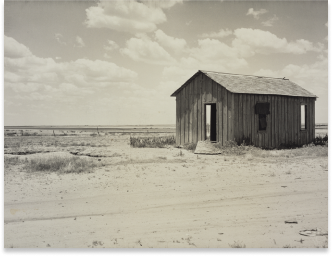

# Макет 4
1. Надпись "“DOROTHEA LANGE":
    > * тип шрифта: __"Montserrat"__
    > * размер шрифта: _`24px`_
2. Надпись “OCTOBER 15 - MARCH 18”:
    > цвет:  `#ff473a`
3. Надпись “FLOOR 3”:
    > * размер шрифта: **`10px`
    > * цвет:  `#979797`
4. Расстояние от изображения до нижней части экрана ___`183.92`___
5. Изображение

   