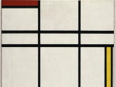

# Макет 6
1. Надпись “DECORATIVE ARTS & CRAFTS ”:
    > * тип шрифта: 'Montserrat'
    > * цвет: __`#ff473a`__
2. Картинка “CUBISM”:
	> размеры: __`165 x 124`__
3. Надпись _“Explore the Collection”_:
    > * размер шрифта: _`18px`_
4. Расстояние от картинки _"AMERICAN"_ до картинки _“GREEK ANTIQUITIES”_ составляет ___18___
5. Изображение __“DE STIJL”__

   